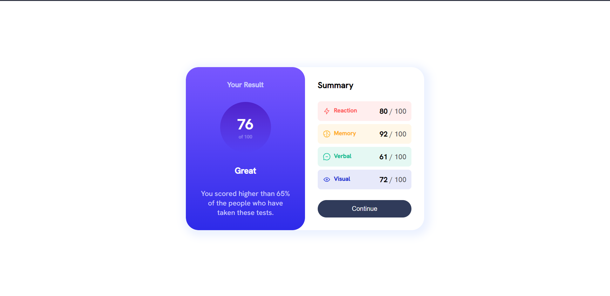

# Frontend Mentor - Results summary component solution  (using only _HMTL_ and _CSS_)

This is a solution to the [Results summary component challenge on Frontend Mentor](https://www.frontendmentor.io/challenges/results-summary-component-CE_K6s0maV). Frontend Mentor challenges help you improve your coding skills by building realistic projects.

## Table of contents

- [Overview](#overview)
  - [The challenge](#the-challenge)
  - [Screenshot](#screenshot)
  - [Links](#links)
- [My process](#my-process)
  - [Built with](#built-with)
  - [What I learned](#what-i-learned)
  - [Continued development](#continued-development)
- [Author](#author)
- [Acknowledgments](#acknowledgments)


## Overview

### The challenge

Users should be able to:

- View the optimal layout for the interface depending on their device's screen size
- See hover and focus states for all interactive elements on the page
- <strike>**Bonus**: Use the local JSON data to dynamically populate the content</strike>

### Screenshot




### Links

- Solution URL: [Add solution URL here](https://your-solution-url.com)
- Live Site URL: [Add live site URL here](https://your-live-site-url.com)

## My process

### Built with

- Semantic HTML5 markup
- CSS custom properties
- Flexbox

### What I learned

- Centering a div (making use of flexbox)
- How to add gradient color
- Responsive page
- Styling button and adding hover feature... and more.

To see how you can add code snippets, see below:

```html
<div class="container">
  <div class="subContainer"></div>
</div>
```

```css
.container {
  display: flex;
  justify-content: center;
  align-items: center;
  min-height: 100vh;
}

.subContainer {
  display: flex;
  max-width: 600px;
  width: 100%;
  background-color: #f5f5f5;
  border-radius: 2rem;
  box-shadow: 5px 5px 20px 10px var(--pale-blue);
  overflow: hidden;
}
```


### Continued development

- Heading for Js and React.


## Author

- <strike>Website - [Add your name here](https://www.your-site.com)</strike>
- Frontend Mentor - [@Henry](https://www.frontendmentor.io/profile/stan545)
- Twitter - [Henry](https://www.twitter.com/stanhenry4)

## Acknowledgments

I would love to say thank you to my Tutor [Benjamin Ovu](https://www.twitter.com/https://twitter.com/oluwa_benji) a.k.a _Your Frontend Engineer_.
